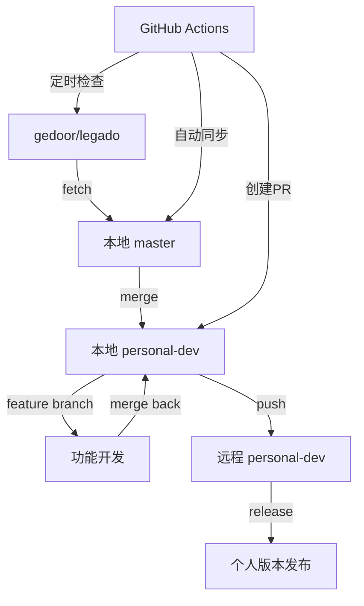

# Legado个人Fork版本 - 完整设置总结

## 🎯 目标实现

您现在拥有一个完整的Legado个人Fork版本维护方案，能够：
- ✅ 维护个人定制版本
- ✅ 持续同步上游更新
- ✅ 自动化日常开发流程
- ✅ 处理合并冲突
- ✅ 版本管理和发布

## 📁 文件结构

```
legado/
├── 📋 FORK_MAINTENANCE_GUIDE.md     # 详细维护指南
├── 📋 PERSONAL_CHANGES.md           # 个人修改记录
├── 📋 README_PERSONAL.md            # 个人版本说明
├── 📋 FORK_SETUP_SUMMARY.md         # 本文件
├── 🚀 setup_personal_fork.sh        # 一键设置脚本
├── 📁 scripts/
│   ├── 🔄 sync_upstream.sh          # 上游同步脚本
│   └── ⚡ dev_workflow.sh           # 开发工作流脚本
├── 📁 .github/workflows/
│   └── 🤖 upstream-sync.yml         # 自动同步工作流
├── 📁 .personal/                    # 个人配置目录
│   └── config.json                  # 个人配置文件
└── 📄 .gitignore.personal           # 个人忽略文件
```

## 🚀 快速开始

### 1. 初始设置（仅需一次）
```bash
# 运行一键设置脚本
./setup_personal_fork.sh
```

### 2. 日常开发流程
```bash
# 查看状态
./scripts/dev_workflow.sh status

# 开发新功能
./scripts/dev_workflow.sh feature my-feature
# ... 进行开发 ...
./scripts/dev_workflow.sh commit "添加新功能"
./scripts/dev_workflow.sh finish

# 同步上游更新
./scripts/sync_upstream.sh
```

## 🔄 工作流程图



## 📋 分支策略

| 分支 | 用途 | 同步方式 |
|------|------|----------|
| `master` | 与上游保持同步 | 自动同步上游 |
| `personal-dev` | 个人开发主分支 | 手动合并master |
| `feature/*` | 功能开发分支 | 从personal-dev创建 |
| `release/*` | 发布准备分支 | 从personal-dev创建 |

## 🛠️ 自动化工具

### 1. 脚本工具
- **setup_personal_fork.sh**: 一键设置开发环境
- **sync_upstream.sh**: 同步上游更新
- **dev_workflow.sh**: 开发工作流管理

### 2. GitHub Actions
- **upstream-sync.yml**: 自动检测并同步上游更新
- 每天自动检查上游更新
- 自动创建同步PR

### 3. 配置管理
- **.personal/config.json**: 个人配置文件
- **.gitignore.personal**: 个人忽略规则

## 📝 版本管理

### 版本号规范
- 格式: `vX.Y.Z-personal.N`
- 示例: `v3.24.1-personal.1`
- 基础版本跟随上游，个人版本递增

### 发布流程
```bash
# 创建发布版本
./scripts/dev_workflow.sh release v3.24.1-personal.1

# 手动发布到GitHub Releases
# 或使用GitHub Actions自动发布
```

## 🔧 常用命令速查

### 开发命令
```bash
# 初始化环境
./scripts/dev_workflow.sh init

# 创建功能分支
./scripts/dev_workflow.sh feature <name>

# 智能提交
./scripts/dev_workflow.sh commit "<message>"

# 完成功能
./scripts/dev_workflow.sh finish

# 查看状态
./scripts/dev_workflow.sh status

# 清理分支
./scripts/dev_workflow.sh clean
```

### 同步命令
```bash
# 同步上游
./scripts/sync_upstream.sh

# 强制同步（有未提交更改时）
./scripts/sync_upstream.sh --force
```

### Git命令
```bash
# 查看远程仓库
git remote -v

# 查看分支
git branch -a

# 查看最新提交
git log --oneline -10

# 查看标签
git tag -l
```

## 🚨 注意事项

### 1. 冲突处理
- 同步上游时可能出现冲突
- 手动解决冲突后提交
- 使用IDE的合并工具辅助

### 2. 备份重要
- 重要修改及时推送到远程
- 定期创建标签备份
- 保持个人修改的文档记录

### 3. 许可证合规
- 保持原项目许可证
- 在README中说明fork来源
- 遵守开源协议

## 🎯 最佳实践

### 1. 开发习惯
- 小步提交，频繁推送
- 清晰的提交消息
- 及时同步上游更新

### 2. 分支管理
- 功能开发使用独立分支
- 保持master分支纯净
- 定期清理已合并分支

### 3. 文档维护
- 及时更新PERSONAL_CHANGES.md
- 记录重要的技术决策
- 保持README的准确性

## 🆘 故障排除

### 常见问题
1. **合并冲突**: 手动解决后提交
2. **权限问题**: 检查SSH密钥或Token
3. **分支混乱**: 使用`git reflog`恢复
4. **脚本权限**: 使用`chmod +x`添加执行权限

### 紧急恢复
```bash
# 重置到上游状态（危险操作）
git fetch upstream
git reset --hard upstream/master

# 查看操作历史
git reflog

# 恢复到特定提交
git reset --hard <commit-hash>
```

## 📞 获取帮助

### 文档资源
- [FORK_MAINTENANCE_GUIDE.md](FORK_MAINTENANCE_GUIDE.md) - 详细维护指南
- [PERSONAL_CHANGES.md](PERSONAL_CHANGES.md) - 修改记录
- [README_PERSONAL.md](README_PERSONAL.md) - 项目说明

### 在线资源
- [Git官方文档](https://git-scm.com/doc)
- [GitHub帮助文档](https://docs.github.com/)
- [上游项目](https://github.com/gedoor/legado)

---

## 🎉 恭喜！

您现在拥有了一个完整的Legado个人Fork版本维护方案！

这个方案包含：
- 📚 完整的文档体系
- 🛠️ 自动化工具链
- 🔄 标准化工作流程
- 🤖 GitHub Actions集成
- 📋 最佳实践指南

现在您可以：
1. 安全地进行个人定制开发
2. 持续获取上游更新
3. 自动化处理日常任务
4. 专业地管理版本发布

**开始您的个人Legado开发之旅吧！** 🚀

---

*创建时间: 2025-09-12*  
*最后更新: 2025-09-12*